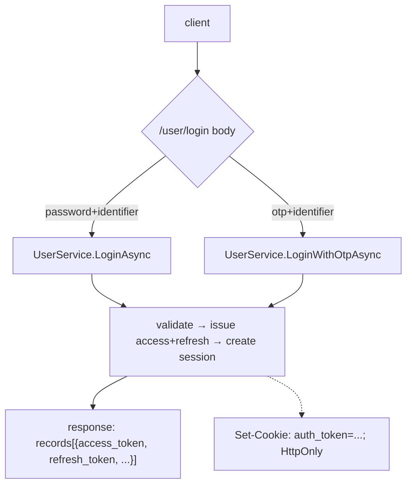

# Authentication

## Overview

Two login paths, all landing on the same `sessions` row + signed JWT:

1. **Password** (`POST /user/login` with shortname/email/msisdn + password).
2. **OTP** (`POST /user/login` with an identifier + `otp`, pre-requested via
   `POST /user/otp-request` with `purpose: "login"`).

`POST /user/otp-request` is the single OTP issuing API: the `purpose` field
(`login` | `reset` | `register` | `verify-contact`) selects what the code is
redeemable for — codes never cross purposes. `register` is the one to use
before `POST /user/create`: that endpoint accepts an `email_otp`/`msisdn_otp`
minted at the register purpose and no other, so a code requested as `login`
cannot complete a signup. Every well-formed request answers 200 Ok
(anti-enumeration); the resend cooldown (`ALLOW_OTP_RESEND_AFTER`) and the
per-destination daily cap (`MAX_OTP_REQUESTS_PER_DAY`) are silent no-ops.
Password resets confirm via `POST /user/password-reset-confirm`; contact
verification happens on `POST /user/verify-contact` (`code` plus `email` or
`msisdn`). That one call both confirms an address already on the row and
changes to a new one — the server tells which from the row it already has, so
there is no separate "change" field to get wrong. `POST /user/profile` cannot
change a contact and points here; it still tolerates `email`/`msisdn` echoed
back unchanged, so a profile read-modify-write round-trip is unaffected. Every OTP verification is single-use (consumed on
success) and capped at `MAX_OTP_VERIFY_ATTEMPTS` wrong guesses per code.

Plus three OAuth callbacks (Google / Facebook / Apple) for web + mobile flows.



## The login response shape

Tokens ride in `records[0].attributes`:

```json
{
  "status": "success",
  "records": [
    {
      "resource_type": "user",
      "shortname": "alice",
      "subpath": "users",
      "attributes": {
        "access_token": "eyJ...",
        "refresh_token": "eyJ...",
        "type": "web",
        "email": "...",
        "msisdn": "...",
        "is_email_verified": true,
        "force_password_change": false
      }
    }
  ]
}
```

`Api/User/AuthHandler.cs` also sets `Set-Cookie: auth_token=<access_token>; HttpOnly; SameSite=Lax; Path=/`.
Browser clients (including CXB) rely on the cookie.

## JWT structure

Hand-rolled HS256. Issuer: `Auth/JwtIssuer.cs`. Verified via JwtBearer with
a custom resolver because our tokens have no `kid` header.

Access token payload:

```json
{
  "data": { "shortname": "alice", "type": "web" },
  "expires": 1713500000,
  "iss": "dmart",
  "aud": "dmart",
  "iat": 1713499000,
  "exp": 1713499900
}
```

Refresh token payload: same shape minus `data.type`, longer `exp`.

`data` wraps the identity claims so the envelope stays stable even if
we add more top-level metadata later. `JwtBearerSetup` parses
`data.shortname` for `ctx.User.Identity.Name`.

### The cookie-or-bearer dance

Most browser traffic sends no `Authorization` header. `Auth/JwtBearerSetup.cs`
configures `JwtBearerEvents.OnMessageReceived` to fall back to
`ctx.Request.Cookies["auth_token"]`:

```csharp
options.Events = new JwtBearerEvents
{
    OnMessageReceived = ctx =>
    {
        if (string.IsNullOrEmpty(ctx.Token))
            ctx.Token = ctx.Request.Cookies["auth_token"];
        return Task.CompletedTask;
    },
    OnChallenge = ctx => { /* emit WWW-Authenticate for MCP clients */ },
};
```

### Required JwtBearer configuration gotcha

`JwtBearerOptions` MUST be configured lazily via
`AddOptions<JwtBearerOptions>().Configure<IOptions<DmartSettings>>(...)`.
If you read `IConfiguration["Dmart:JwtSecret"]` directly inside
`AddDmartAuth`, the value is captured at services-build time — BEFORE
`WebApplicationFactory.ConfigureWebHost` adds in-memory test config, so
tests see "signature key not found" errors.

And .NET 9+ `JsonWebTokenHandler` looks up keys by `kid`. Our tokens have
no `kid`, so we MUST set
`IssuerSigningKeyResolver = (_,_,_,_) => new[] { signingKey }`.

## Password hashing

`Auth/PasswordHasher.cs` wraps `Konscious.Security.Cryptography.Argon2` 1.3.1.
Format: PHC string
`$argon2id$v=19$m=102400,t=3,p=8$<b64-no-pad-salt>$<b64-no-pad-hash>`.

Parameters: `memory_cost=102400, time_cost=3, parallelism=8`. The PHC
string is self-describing, so hashes are portable across any
conformant Argon2id implementation.

## Password rules (PASSWORD regex)

`Auth/PasswordRules.cs` — source-gen regex:

```
^(?=.*[0-9\u0660-\u0669])(?=.*[A-Z\u0621-\u064a])
[a-zA-Z\u0621-\u064a0-9\u0660-\u0669 _#@%*!?$^&()+={}\[\]~|;:,.<>/-]{8,64}$
```

- 8-64 chars
- At least one digit (ASCII or Arabic-Indic)
- At least one uppercase letter (Latin or Arabic letter range)
- Whitelisted symbols only

`UserService.UpdateProfileAsync` rejects weak passwords with
`INVALID_PASSWORD_RULES` (17) + type=`jwtauth`.

## Login error shapes

Pinned by `dmart.Tests/Integration/LoginErrorCodesTests.cs` and
`dmart.Tests/Integration/ErrorCodeParityTests.cs`:

| Condition | `type` | `code` | `message` |
|---|---|---|---|
| Unknown username | auth | 18 (`USERNAME_NOT_EXIST`) | "Invalid username or password" |
| Wrong password | auth | 13 (`PASSWORD_NOT_VALIDATED`) | "Invalid username or password" |
| `is_active=false` | auth | 11 (`USER_ISNT_VERIFIED`) | "This user is not verified" |
| Attempt count reached | auth | 110 (`USER_ACCOUNT_LOCKED`) | "Account has been locked due to too many failed login attempts." |
| Locked to different device | auth | 110 (`USER_ACCOUNT_LOCKED`) | "This account is locked to a unique device !" |
| Mobile new device (no OTP) | auth | 115 (`OTP_NEEDED`) | "New device detected, login with otp" |
| OTP login multi-identifier | auth | 100 (`OTP_ISSUE`) | "Provide either msisdn, email or shortname, not both." |
| OTP login no identifier | auth | 100 (`OTP_ISSUE`) | "Either msisdn, email or shortname must be provided." |
| Wrong OTP | auth | 307 (`OTP_INVALID`) | "Wrong OTP" |
| Missing/expired JWT on `/managed/*` | jwtauth | 49 (`NOT_AUTHENTICATED`) | "Not authenticated" |
| Expired signature | jwtauth | 48 (`EXPIRED_TOKEN`) | "..." |
| Bad signature | jwtauth | 47 (`INVALID_TOKEN`) | "..." |

## Sessions

Every successful login upserts a `sessions` row keyed by
`(shortname, access_token)`. Columns:
- `access_token` — verbatim JWT, used for inactivity check
- `last_used_at` — bumped on every request
- `firebase_token` — optional, updated via `PATCH /user/profile` body
  `{firebase_token: "..."}`

When `settings.SessionInactivityTtl > 0`, requests with a token whose
`sessions.last_used_at` is older than the TTL are rejected and the row is
deleted.

## Account lockout + attempt counter

`users.attempt_count` is incremented on every bad-password/bad-OTP attempt, which
also stamps `users.last_failed_login`. When the count reaches
`settings.MaxFailedLoginAttempts` (default 5) the account is locked and login
returns `USER_ACCOUNT_LOCKED` even on a correct password.

**The lock is the counter, and nothing else.** It does not touch `is_active` and
does not wipe the user's sessions:

- `is_active = false` means one thing only — an admin deactivated the account.
- A locked user's **already-issued access token keeps working** until it expires.
  The lock blocks new logins; it does not sign the victim out of every device
  because a stranger guessed at their password.
- It does block **refresh**: both `/oauth/token` grants (`refresh_token` and
  `authorization_code`) re-check the lock and return `invalid_grant`, so a locked
  session ends at the next refresh. The blast radius is bounded by the access
  token's TTL rather than by immediate revocation.
- **One session is revoked**: the one that made the attempt that tripped the lock,
  and only when that attempt came through an authenticated endpoint
  (`/user/profile`'s `old_password`, `/user/validate_password`). Someone
  brute-forcing a password from inside a session they already hold — a hijacked
  one, in the case this defends against — must not keep that token for the rest of
  its TTL. Anonymous `/user/login` attempts have no session to name and revoke
  nothing.

The tradeoff is deliberate: an attacker who guesses the password before tripping
the threshold, and then logs in normally, is not kicked out by a later lock.

### The gate is a pure read

`UserService.IsLocked` is what the non-login gates (`/user/otp-request`, both
`/oauth/token` grants) ask, and it writes nothing. It reports that the cool-down
has released a lock; it does not persist that release — only a real login attempt
does, through `RejectIfAttemptLockedAsync`. Presenting a refresh token or asking
for an OTP is not a login, and neither should be able to clear `attempt_count`,
which is both the lock itself and the only surviving record of a brute-force run.

It also checks `is_active` / `is_deleted` **before** the counter, so a deactivated
or soft-deleted account is locked whatever the cool-down says.

### Bot accounts are exempt

A `type = bot` account is never locked by the attempt counter. The counter still
increments — so brute force against a bot stays visible in `attempt_count` — but
it never trips. Two reasons: a bot authenticates from CI/MCP with a machine
credential nobody is guessing, and a bot never re-runs `/user/login`, so the
cool-down below is unreachable for it and a lock would be permanent. Locking one
would let anyone who knows the shortname take down a whole integration with five
requests. A bot is still subject to the ordinary `is_active` / soft-delete gate.

### Cool-down auto-unlock (`LockoutCooldownSeconds`, default 900)

The lock is **not permanent**. `UserService.RejectIfAttemptLockedAsync` (the gate
that runs first in both the password and OTP login paths) checks
`last_failed_login`: once `now − last_failed_login > LockoutCooldownSeconds`, the
next login attempt auto-clears the lock (`attempt_count = 0`,
`last_failed_login = NULL`) and proceeds to the normal credential check. It leaves
`is_active` alone — an account that is both deactivated and at the threshold must
not be handed back the flag an admin cleared.

The window is measured from the **last** failed/blocked attempt and is **refreshed
on every attempt while locked**, so a persistent attacker never auto-unlocks — only
an account left idle for the full window recovers. The cool-down applies **only** to
the attempt-counter lock; a manually deactivated or never-verified account
(`attempt_count < max`) is handled by the separate `is_active` gate and never
auto-unlocks.

Set `LOCKOUT_COOLDOWN_SECONDS=0` to disable auto-unlock and keep the lock permanent
until an admin resets it (the pre-cooldown behaviour, and the Python-reference
behaviour — Python has no cool-down).

`attempt_count` is returned on a user read, so an admin UI can show that an
account is locked — the lock leaves `is_active` set, so the counter is the only
thing that says so. cxb and catalog surface it on the user form and strip it from
ordinary saves, the same way they strip `password`; ticking "clear on save" is
what sends the unlock.

Admin manual unlock is a user update carrying an explicit `attempt_count`:

```json
{"space_name": "management", "request_type": "update",
 "records": [{"resource_type": "user", "subpath": "/users",
              "shortname": "...", "attributes": {"attempt_count": 0}}]}
```

It has to be `attempt_count` and not `is_active: true`. A locked account is still
active, so there is no `false → true` transition to key an unlock off — and keying
it off the mere *presence* of the flag would be worse, because the admin UI emits
`is_active` on every save. Editing a locked user's display name would then cancel
an in-progress lockout the admin never meant to touch. Nothing echoes
`attempt_count` back (it is not part of a user read), so it appears in an update
only when a human put it there.

A genuine reactivation (`is_active` going `false → true`) does still clear the
counter: an account coming back from a deactivation should not be one mistyped
password away from locking again.

The unlock is audited. `attempt_count` is normally excluded from the history diff
— every failed login moves it — but an admin *clearing* it writes a history row
naming the actor, so `/managed/query?type=history` records who lifted a lockout.

Or directly:

```sql
UPDATE users SET attempt_count = 0, last_failed_login = NULL WHERE shortname = '...';
```

### Upgrading from a pre-1.5.6 release

The previous lockout wrote `is_active = false` alongside the counter. Under the
rules above those rows read as admin deactivations, which the cool-down
deliberately refuses to undo — so every account the old release auto-locked would
stay locked out permanently, with no login-side path that recovers it.

**The server repairs them at startup.** It reactivates exactly the rows carrying
the old lock's signature — `is_active = false AND attempt_count >=
MAX_FAILED_LOGIN_ATTEMPTS` — and logs a warning naming the count. On the first
boot after an upgrade that heals the database; every boot after that is a no-op.

That pair is unambiguous because no current code path can write it. An ordinary
admin deactivation cannot: `RejectIfNotActive` runs before the credential check,
so a deactivated account never reaches the counter to raise it. An admin
deactivating an account that is *already* attempt-locked cannot either, because
the managed user update clears `attempt_count` when it deactivates — the mirror
of clearing it when it reactivates. The signature belongs to the release that
wrote it, and to nothing else.

The one case it gets wrong is inherent to the data rather than to the timing: an
account that a pre-upgrade admin deactivated *and* that was already at the
threshold looks exactly like an auto-lock, and is reactivated. The old release
wrote both columns for a lock, so nothing in the row distinguishes them. Audit
`is_active` on accounts you deliberately disabled before upgrading.

Set `REPAIR_LEGACY_LOCKOUTS_ON_START=false` to keep startup strictly read-only;
`dmart migrate` runs the same repair and prints the count, so an operator who
wants to see it before the server takes traffic can.

## OAuth providers (Google / Facebook / Apple)

Two flows per provider: web (code → id_token) and mobile (client-obtained
id_token → local login).

### Google
- `GET /user/google/callback?code=...&state=...` — exchanges code at
  `oauth2.googleapis.com/token`, verifies id_token's `aud` matches
  `GoogleClientId`.
- `POST /user/google/mobile-login {id_token: "..."}` — verifies via
  Google's tokeninfo endpoint.

### Facebook
- `GET /user/facebook/callback?code=...` — exchanges code, verifies via
  Graph API `debug_token` using `{ClientId}|{ClientSecret}` as the app
  token.
- `POST /user/facebook/mobile-login {access_token: "..."}`.

### Apple
- `GET /user/apple/callback` (form-post with id_token) — verifies RS256
  against `appleid.apple.com/auth/keys` (cached 1h). Code → id_token
  exchange is not implemented; the callback returns a clean error when
  Apple posts back only a `code`.
- `POST /user/apple/mobile-login {id_token: "..."}`.

Resolution: if the email matches an existing user, log them in; otherwise
create a new user with the OAuth provider's profile info
(`Auth/OAuth/OAuthUserResolver.cs`).

## AdminBootstrap

First-boot seeding. `DataAdapters/Sql/AdminBootstrap.cs` creates:

1. `users.dmart` — admin, passwordless, with `super_admin` role. Password
   is set via `dmart passwd` subcommand or env `Dmart__AdminPassword`
   on **first creation only**.
2. `roles.super_admin` with permissions `["super_manager"]`.
3. `permissions.super_manager` — keyed `__all_spaces__: [__all_subpaths__]`,
   granting every action on every resource_type.
4. `spaces.management` + its folders `users`, `roles`, `permissions`,
   `schema`.

Idempotent: skips if rows already exist, but heals a `super_admin` role
row with an empty permissions list.

## Anonymous

A reserved shortname used for unauthenticated callers. Not auto-created.
See [permissions.md](./permissions.md) for how anonymous resolution works.

## Rate limiting (auth endpoints)

`ASP.NET Core`'s built-in `RateLimiter` is wired in `Program.cs` with an
`auth-by-ip` policy (10 requests/min per IP) on `/user/login`. Triggered
clients see HTTP 429. Per-endpoint policies can be added around more of
the `/user/*` surface (OTP request, register, reset).

**Not yet rate-limited:** `/oauth/register`, `/oauth/authorize`,
`/oauth/token` (MCP OAuth AS). Documented as deferred hardening.

## Code map

| Concern | File |
|---|---|
| JwtBearer config + cookie fallback | `Auth/JwtBearerSetup.cs` |
| JWT minting | `Auth/JwtIssuer.cs` |
| Password verify/hash | `Auth/PasswordHasher.cs` |
| Password regex | `Auth/PasswordRules.cs` |
| OTP generation + dispatch | `Auth/OtpProvider.cs` |
| Google / Facebook / Apple | `Auth/OAuth/*.cs` |
| Login endpoints | `Api/User/AuthHandler.cs` |
| OTP endpoints | `Api/User/OtpHandler.cs` |
| Profile (GET / PATCH / delete) | `Api/User/ProfileHandler.cs` |
| User creation + auto-login | `Api/User/RegistrationHandler.cs` + `Services/UserService.CreateAsync` |
| Session DB ops | `DataAdapters/Sql/UserRepository.cs` (Create/UpdateSession*) |
| First-boot seeding | `DataAdapters/Sql/AdminBootstrap.cs` |
